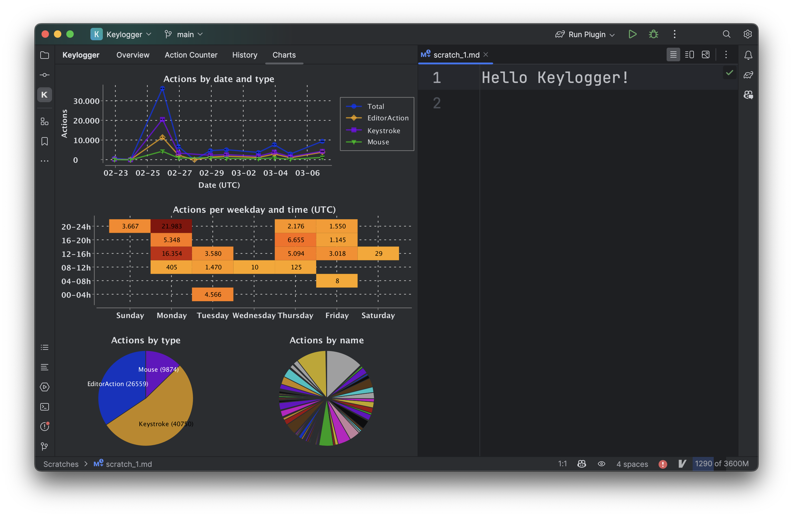

# Keylogger

<!-- Plugin description -->

This plugin provides a simple tool window to see statistics about your actions in the editor.

## Features

- Listens for actions in the editor (typing, clicking, shortcuts)
- Stores the actions in a local SQLite database file (can be customized)
- Shows a simple tool window with a table of the actions and some statistics
    - active time, idle time
    - actions per minute, unique actions, ...
- Configurable idle timeout

<!-- Plugin description end -->

## Roadmap

- [ ] Start with template project
    - [x] Create a new [IntelliJ Platform Plugin Template][template] project.
    - [x] Get familiar with the [template documentation][template].
    - [x] Adjust the [pluginGroup](./gradle.properties), [plugin ID](./src/main/resources/META-INF/plugin.xml)
      and [sources package](./src/main/kotlin).
    - [x] Adjust the plugin description in `README` (see [Tips][docs:plugin-description])
    - [x] Review
      the [Legal Agreements](https://plugins.jetbrains.com/docs/marketplace/legal-agreements.html?from=IJPluginTemplate).
    - [x] [Publish a plugin manually](https://plugins.jetbrains.com/docs/intellij/publishing-plugin.html?from=IJPluginTemplate)
      for the first time.
    - [x] Set the `PLUGIN_ID` in the above README badges.
    - [x] Set
      the [Plugin Signing](https://plugins.jetbrains.com/docs/intellij/plugin-signing.html?from=IJPluginTemplate)
      related [secrets](https://github.com/JetBrains/intellij-platform-plugin-template#environment-variables).
    - [x] Set
      the [Deployment Token](https://plugins.jetbrains.com/docs/marketplace/plugin-upload.html?from=IJPluginTemplate).
    - [x] Click the <kbd>Watch</kbd> button on the top of the [IntelliJ Platform Plugin Template][template] to be
      notified about releases containing new features and fixes.
- [x] Prototype
    - [x] Action/click/type listeners
    - [x] Create a simple tool window
    - [x] First (hidden) release
- [x] Minimum viable plugin
    - [x] Persist data
    - [x] Make things like idle timeout configurable via plugin settings
    - [x] Restore default settings button, delete database button in settings page
- [ ] General improvements 
    - [ ] Listen to "Editor Active" events to make sure the idle timeout is accurate and only one session is recorded
    - [ ] Improve UI by implementing custom cell renderers etc. for tables
    - [ ] Custom SVG icon
    - [ ] Database schema validation on startup
- [ ] Quality
    - [ ] Logging
    - [ ] CI/CD pipeline complete
    - [ ] Write meaningful tests
    - [ ] Improve error handling
    - [ ] Deal with dependabot
- [ ] Future feature ideas
    - [ ] Welcome Dialog
    - [ ] Notifications (e.g. "Database successfully deleted")
    - [ ] History of actions
    - [ ] Store entire SQLite database in plugin settings, so that it works with settings sync (allowed maximum size?)
    - [ ] Charts and visualizations
    - [ ] Status bar widget that shows the current APM (or other statistics)
    - [ ] Progress bar that shows the idle timeout
    - [ ] Data export
    - [ ] Demo video (must be hosted on YouTube)

## Development

For general development information, visit the [IntelliJ Platform Plugin Template][template] repository.

Visit the plugin repository at [github.com/jpv-os/Keylogger](https://github.com/jpv-os/Keylogger)
for the latest information and to report issues. Pull requests are welcome.

## Installation

- Using the IDE built-in plugin system:

  <kbd>Settings/Preferences</kbd> > <kbd>Plugins</kbd> > <kbd>Marketplace</kbd> > <kbd>Search for "Keylogger"</kbd> >
  <kbd>Install</kbd>

- Manually:

  Download the [latest release](https://github.com/jpv-os/Keylogger/releases/latest) and install it manually using
  <kbd>Settings/Preferences</kbd> > <kbd>Plugins</kbd> > <kbd>⚙️</kbd> > <kbd>Install plugin from disk...</kbd>

---
Plugin based on the [IntelliJ Platform Plugin Template][template].

[template]: https://github.com/JetBrains/intellij-platform-plugin-template

[docs:plugin-description]: https://plugins.jetbrains.com/docs/intellij/plugin-user-experience.html#plugin-description-and-presentation
